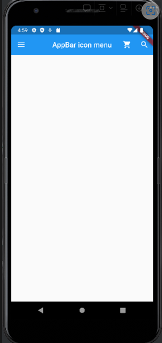

# appbar

```dart
import 'package:flutter/material.dart';

void main() {
  // main 스레드는 runApp을 실행시키고 종료된다.
  runApp(FirstApp());
}
class FirstApp extends StatelessWidget {
  @override
  Widget build(BuildContext context) {
    return MaterialApp(
      title: 'First App',
      theme: ThemeData(
        primaryColor: Colors.Blue
      ),
      home: MyHomePage(),
    );
  }
}

class MyHomePage extends StatelessWidget {
  // const MyHomePage({super.key});
  @override
  Widget build(BuildContext context) {
    return Scaffold(
      appBar: AppBar(
        title: Text('AppBar icon menu'),
        centerTitle: true,
        elevation: 0.0,
        leading: IconButton(
          icon: Icon(Icons.menu),
          onPressed: () {
          print('button clicked');
        },
        ),
        actions: [
          IconButton(
              onPressed: () {print('cart pressed');},
              icon: Icon(Icons.shopping_cart)),
          IconButton(
              onPressed: () {print('unit pressed');},
              icon: Icon(Icons.search))
        ],
      ),
    );
  }
}

```

