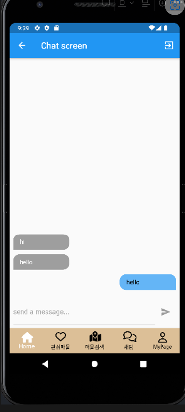

# firebase로 채팅 구현하기

- dm/chat/chat_bubble.dart

```dart
import 'package:flutter/material.dart';

class ChatBubble extends StatelessWidget {
  const ChatBubble(this.message,this.isMe, {Key? key}) : super(key: key);

  final String message;
  final bool isMe;

  @override
  Widget build(BuildContext context) {
    return Row(
      mainAxisAlignment: isMe ? MainAxisAlignment.end : MainAxisAlignment.start,
      children: [
        Container(
          decoration: BoxDecoration(
            color: isMe? Colors.blue[300] : Colors.grey[500],
                borderRadius: BorderRadius.only(
                  topRight: Radius.circular(15),
                  topLeft: Radius.circular(15),
                  bottomRight: isMe ? Radius.circular(0) : Radius.circular(15),
                  bottomLeft: isMe ? Radius.circular(15) : Radius.circular(0),
                ),

          ),
          width: 130,
          padding: EdgeInsets.symmetric(vertical: 10, horizontal: 15),
          margin: EdgeInsets.symmetric(vertical: 5, horizontal: 8),
          child: Text(
            message,
            style: TextStyle(
              color: isMe ? Colors.black : Colors.white
            ),
          ),
        ),
      ],
    );
  }
}

```

- dm/chat/message.dart

```dart
import 'package:flutter/material.dart';
import 'package:cloud_firestore/cloud_firestore.dart';
import 'package:prac2/dm/chat/chat_bubble.dart';
import 'package:firebase_auth/firebase_auth.dart';

class Messages extends StatelessWidget {
  const Messages({super.key});

  @override
  Widget build(BuildContext context) {
    final user = FirebaseAuth.instance.currentUser;

    return StreamBuilder(
      stream: FirebaseFirestore.instance
          .collection('chat')
          .orderBy('time', descending: true)
          .snapshots(),
      builder: (context, AsyncSnapshot<QuerySnapshot<Map<String, dynamic>>> snapshot){
        if (snapshot.connectionState == ConnectionState.waiting){
          return Center(
            child: CircularProgressIndicator(),
          );
        }
        final chatDocs = snapshot.data!.docs;

        return ListView.builder(
          reverse: true,
          itemCount: chatDocs.length,
          itemBuilder: (context, index){
            return ChatBubble(
                chatDocs[index]['text'],
                chatDocs[index]['userID'].toString() == user?.uid,
            );
          },
        );
      },
    );
  }
}

```

- dm/chat/new_message.dart

```dart
import 'package:flutter/material.dart';
import 'package:cloud_firestore/cloud_firestore.dart';
import 'package:firebase_auth/firebase_auth.dart';

class NewMessage extends StatefulWidget {
  const NewMessage({super.key});

  @override
  State<NewMessage> createState() => _NewMessageState();
}

class _NewMessageState extends State<NewMessage> {
  final _controller = TextEditingController();

  var _userEnterMessage = '';
  void _sendMessage(){ // 메서드 이름 변경: _sendMessage
    FocusScope.of(context).unfocus();
    final user = FirebaseAuth.instance.currentUser;
    FirebaseFirestore.instance.collection('chat').add({
      'text': _userEnterMessage,
      'time': Timestamp.now(),
      'userID': user!.uid,
    });
    _controller.clear();
  }

  @override
  Widget build(BuildContext context) {
    return Container(
      margin: EdgeInsets.only(top: 8),
      padding: EdgeInsets.all(8),
      child: Row(
        children: [
          Expanded(
            child: TextField(
              maxLines: null,
              controller: _controller,
              decoration: InputDecoration(
                labelText: 'send a message...',
                labelStyle: TextStyle(
                  color: Colors.grey,
                ),
              ),
              onChanged: (value) {
                setState(() {
                  _userEnterMessage = value;
                });
              },
            ),
          ),
          IconButton(
            onPressed: _userEnterMessage.trim().isEmpty ? null : _sendMessage,
            icon: Icon(Icons.send),
            color: Colors.blue,
          ),
        ],
      ),
    );
  }
}

```

- dm/chat_screen.dart

```dart
import 'package:flutter/material.dart';
import 'package:firebase_auth/firebase_auth.dart';
import 'package:cloud_firestore/cloud_firestore.dart';
import 'package:prac2/dm/chat/message.dart';
import 'package:prac2/dm/chat/new_message.dart';

class ChatScreen extends StatefulWidget {
  const ChatScreen({Key? key}) : super(key: key);

  @override
  _ChatScreenState createState() => _ChatScreenState();
}

class _ChatScreenState extends State<ChatScreen> {
  final _authentication = FirebaseAuth.instance;
  User? loggedUser;

  @override
  void initState() {
    // TODO: implement initState
    super.initState();
    getCurrentUser();
  }

  void getCurrentUser(){
    try {
      final user = _authentication.currentUser;
      if (user != null) {
        loggedUser = user;
        print(loggedUser!.email);
      }
    }catch(e){
      print(e);
    }
  }

  @override
  Widget build(BuildContext context) {
    return Scaffold(
      appBar: AppBar(
        title: Text('Chat screen'),
        actions: [
          IconButton(
            icon: Icon(
              Icons.exit_to_app_sharp,
              color: Colors.white,
            ),
            onPressed: (){
              _authentication.signOut();
              // Navigator.pop(context);
            },
          )
        ],
      ),
      body: Container(
        child: Column(
          children: [
            Expanded(
                child: Messages()
            ),
            NewMessage(),
          ],
        )
      ),
    );
  }
}

```

- dm/directMessageLogin.dart

```dart
import 'package:flutter/material.dart';
import 'package:firebase_auth/firebase_auth.dart';
import 'package:prac2/dm/chat_screen.dart';
import 'package:modal_progress_hud_nsn/modal_progress_hud_nsn.dart';
import 'package:cloud_firestore/cloud_firestore.dart';

class directMessageLogin extends StatefulWidget {
  const directMessageLogin({super.key});

  @override
  State<directMessageLogin> createState() => _directMessageLoginState();
}

class _directMessageLoginState extends State<directMessageLogin> {
  FirebaseAuth _authentication = FirebaseAuth.instance;
  bool isSignupScreen = true;
  bool showSpinner = false;
  final _formKey = GlobalKey<FormState>();
  String userName = '';
  String userEmail = '';
  String userPassword = '';

  void _tryValidation() {
    final isValid = _formKey.currentState!.validate();
    if (isValid) {
      _formKey.currentState!.save();
    }
  }

  @override
  Widget build(BuildContext context) {
    return Scaffold(
      body: Stack(
        children: [
          Positioned(
            top: 0,
            right: 0,
            left: 0,
            child: Container(
              height: 200,
              decoration: BoxDecoration(
                image: DecorationImage(
                    image: AssetImage('assets/images/img_7.png'),
                    fit: BoxFit.fill),
              ),
              child: Container(
                padding: EdgeInsets.only(top: 90, left: 20),
                child: Column(
                  crossAxisAlignment: CrossAxisAlignment.start,
                  children: [
                    RichText(
                      text: TextSpan(
                        text: 'Welcome',
                        style: TextStyle(
                            letterSpacing: 1.0,
                            fontSize: 25,
                        ),
                        children: [
                          TextSpan(
                            text:
                            isSignupScreen ? ' to Yummy chat!' : ' back',
                            style: TextStyle(
                              letterSpacing: 1.0,
                              fontSize: 25,

                              fontWeight: FontWeight.bold,
                            ),
                          ),
                        ],
                      ),
                    ),
                    SizedBox(
                      height: 5.0,
                    ),
                    Text(
                      isSignupScreen
                          ? 'Signup to continue'
                          : 'Signin to continue',
                      style: TextStyle(
                        letterSpacing: 1.0,
                      ),
                    ),
                  ],
                ),
              ),
            ),
          ),
          //배경
          AnimatedPositioned(
            duration: Duration(milliseconds: 500),
            curve: Curves.easeIn,
            top: 180,
            child: AnimatedContainer(
              duration: Duration(milliseconds: 500),
              curve: Curves.easeIn,
              padding: EdgeInsets.all(20.0),
              height: isSignupScreen ? 280.0 : 250.0,
              width: MediaQuery.of(context).size.width - 40,
              margin: EdgeInsets.symmetric(horizontal: 20.0),
              decoration: BoxDecoration(
                borderRadius: BorderRadius.circular(15.0),
                boxShadow: [
                  BoxShadow(
                      color: Colors.black.withOpacity(0.3),
                      blurRadius: 15,
                      spreadRadius: 5),
                ],
              ),
              child: SingleChildScrollView(
                padding: EdgeInsets.only(bottom: 20),
                child: Column(
                  children: [
                    Row(
                      mainAxisAlignment: MainAxisAlignment.spaceAround,
                      children: [
                        GestureDetector(
                          onTap: () {
                            setState(() {
                              isSignupScreen = false;
                            });
                          },
                          child: Column(
                            children: [
                              Text(
                                'LOGIN',
                                style: TextStyle(
                                    fontSize: 16,
                                    fontWeight: FontWeight.bold,
                                   ),
                              ),
                              if (!isSignupScreen)
                                Container(
                                  margin: EdgeInsets.only(top: 3),
                                  height: 2,
                                  width: 55,
                                  color: Colors.orange,
                                )
                            ],
                          ),
                        ),
                        GestureDetector(
                          onTap: () {
                            setState(() {
                              isSignupScreen = true;
                            });
                          },
                          child: Column(
                            children: [
                              Text(
                                'SIGNUP',
                                style: TextStyle(
                                    fontSize: 16,
                                    fontWeight: FontWeight.bold,
                                   ),
                              ),
                              if (isSignupScreen)
                                Container(
                                  margin: EdgeInsets.only(top: 3),
                                  height: 2,
                                  width: 55,
                                  color: Colors.orange,
                                )
                            ],
                          ),
                        )
                      ],
                    ),
                    if (isSignupScreen)
                      Container(
                        margin: EdgeInsets.only(top: 20),
                        child: Form(
                          key: _formKey,
                          child: Column(
                            children: [
                              TextFormField(
                                key: ValueKey(1),
                                validator: (value) {
                                  if (value!.isEmpty || value.length < 4) {
                                    return 'Please enter at least 4 characters';
                                  }
                                  return null;
                                },
                                onSaved: (value) {
                                  userName = value!;
                                },
                                onChanged: (value) {
                                  userName = value;
                                },
                                decoration: InputDecoration(
                                    prefixIcon: Icon(
                                      Icons.account_circle,
                                    ),
                                    enabledBorder: OutlineInputBorder(
                                      borderRadius: BorderRadius.all(
                                        Radius.circular(35.0),
                                      ),
                                    ),
                                    focusedBorder: OutlineInputBorder(

                                      borderRadius: BorderRadius.all(
                                        Radius.circular(35.0),
                                      ),
                                    ),
                                    hintText: 'User name',
                                    hintStyle: TextStyle(
                                        fontSize: 14,
                                ),
                                    contentPadding: EdgeInsets.all(10)),
                              ),
                              SizedBox(
                                height: 8,
                              ),
                              TextFormField(
                                keyboardType: TextInputType.emailAddress,
                                key: ValueKey(2),
                                validator: (value) {
                                  if (value!.isEmpty && !value.contains('@')) {
                                    return 'Please enter a valid email address.';
                                  }
                                  return null;
                                },
                                onSaved: (value) {
                                  userEmail = value!;
                                },
                                onChanged: (value) {
                                  userEmail = value;
                                },
                                decoration: InputDecoration(
                                    prefixIcon: Icon(
                                      Icons.email,
                                    ),
                                    enabledBorder: OutlineInputBorder(
                                      borderSide: BorderSide(
                                ),
                                      borderRadius: BorderRadius.all(
                                        Radius.circular(35.0),
                                      ),
                                    ),
                                    focusedBorder: OutlineInputBorder(
                                      borderSide: BorderSide(
                                   ),
                                      borderRadius: BorderRadius.all(
                                        Radius.circular(35.0),
                                      ),
                                    ),
                                    hintText: 'email',
                                    hintStyle: TextStyle(
                                        fontSize: 14,
                                 ),
                                    contentPadding: EdgeInsets.all(10)),
                              ),
                              SizedBox(
                                height: 8,
                              ),
                              TextFormField(
                                obscureText: true,
                                key: ValueKey(3),
                                validator: (value) {
                                  if (value!.isEmpty || value.length < 7) {
                                    return 'Password must be at least 7 characters long.';
                                  }
                                  return null;
                                },
                                onSaved: (value) {
                                  userPassword = value!;
                                },
                                onChanged: (value) {
                                  userPassword = value;
                                },
                                decoration: InputDecoration(
                                    prefixIcon: Icon(
                                      Icons.lock,
                                    ),
                                    enabledBorder: OutlineInputBorder(
                                      borderSide: BorderSide(
                                 ),
                                      borderRadius: BorderRadius.all(
                                        Radius.circular(35.0),
                                      ),
                                    ),
                                    focusedBorder: OutlineInputBorder(
                                      borderSide: BorderSide(
                          ),
                                      borderRadius: BorderRadius.all(
                                        Radius.circular(35.0),
                                      ),
                                    ),
                                    hintText: 'password',
                                    hintStyle: TextStyle(
                                        fontSize: 14,
     ),
                                    contentPadding: EdgeInsets.all(10)),
                              )
                            ],
                          ),
                        ),
                      ),
                    if (!isSignupScreen)
                      Container(
                        margin: EdgeInsets.only(top: 20),
                        child: Form(
                          key: _formKey,
                          child: Column(
                            children: [
                              TextFormField(
                                key: ValueKey(4),
                                validator: (value) {
                                  if (value!.isEmpty ||
                                      !value.contains('@')) {
                                    return 'Please enter a valid email address.';
                                  }
                                  return null;
                                },
                                onSaved: (value) {
                                  userEmail = value!;
                                },
                                onChanged: (value) {
                                  userEmail = value;
                                },
                                decoration: InputDecoration(
                                    prefixIcon: Icon(
                                      Icons.email,
                                    ),
                                    enabledBorder: OutlineInputBorder(
                                      borderSide: BorderSide(
                          ),
                                      borderRadius: BorderRadius.all(
                                        Radius.circular(35.0),
                                      ),
                                    ),
                                    focusedBorder: OutlineInputBorder(
                                      borderSide: BorderSide(
                                    ),
                                      borderRadius: BorderRadius.all(
                                        Radius.circular(35.0),
                                      ),
                                    ),
                                    hintText: 'email',
                                    hintStyle: TextStyle(
                                        fontSize: 14,
                                   ),
                                    contentPadding: EdgeInsets.all(10)),
                              ),
                              SizedBox(
                                height: 8.0,
                              ),
                              TextFormField(
                                key: ValueKey(5),
                                validator: (value) {
                                  if (value!.isEmpty || value.length < 7) {
                                    return 'Password must be at least 7 characters long.';
                                  }
                                  return null;
                                },
                                onSaved: (value) {
                                  userPassword = value!;
                                },
                                onChanged: (value) {
                                  userPassword = value;
                                },
                                decoration: InputDecoration(
                                    prefixIcon: Icon(
                                      Icons.lock,
                                    ),
                                    enabledBorder: OutlineInputBorder(
                                      borderRadius: BorderRadius.all(
                                        Radius.circular(35.0),
                                      ),
                                    ),
                                    focusedBorder: OutlineInputBorder(
                                      borderRadius: BorderRadius.all(
                                        Radius.circular(35.0),
                                      ),
                                    ),
                                    hintText: 'password',
                                    hintStyle: TextStyle(
                                        fontSize: 14,
                               ),
                                    contentPadding: EdgeInsets.all(10)),
                              )
                            ],
                          ),
                        ),
                      )
                  ],
                ),
              ),
            ),
          ),
          //텍스트 폼 필드
          AnimatedPositioned(
            duration: Duration(milliseconds: 500),
            curve: Curves.easeIn,
            top: isSignupScreen ? 430 : 390,
            right: 0,
            left: 0,
            child: Center(
              child: Container(
                padding: EdgeInsets.all(15),
                height: 90,
                width: 90,
                decoration: BoxDecoration(
                    borderRadius: BorderRadius.circular(50)),
                child: GestureDetector(
                  onTap: () async {
                    setState(() {
                      showSpinner = true;
                    });
                    if (isSignupScreen) {
                      _tryValidation();

                      try {
                        final newUser = await _authentication.createUserWithEmailAndPassword(
                          email: userEmail,
                          password: userPassword,
                        );

                        await FirebaseFirestore.instance.collection('user').doc(newUser.user!.uid)
                        .set({
                          'userName' : userName,
                          'email' : userEmail
                        });

                        if (newUser.user != null) {
                          // Navigator.push(
                          //   context,
                          //   MaterialPageRoute(
                          //     builder: (context) {
                          //       return ChatScreen();
                          //     },
                          //   ),
                          // );
                          setState(() {
                            showSpinner = false;
                          });
                        }
                      } catch (e) {
                        print(e);
                        ScaffoldMessenger.of(context).showSnackBar(
                          SnackBar(
                            content:
                            Text('Please check your email and password'),
                          ),
                        );
                      }
                    }

                    if (!isSignupScreen) {
                      _tryValidation();

                      try {
                        final newUser =
                        await _authentication.signInWithEmailAndPassword(
                          email: userEmail,
                          password: userPassword,
                        );
                        if (newUser.user != null) {
                          Navigator.push(
                            context,
                            MaterialPageRoute(
                              builder: (context) {
                                return ChatScreen();
                              },
                            ),
                          );
                        }
                      }catch(e){
                        print(e);
                      }
                    }
                  },
                  child: Container(
                    decoration: BoxDecoration(
                      borderRadius: BorderRadius.circular(30),
                      boxShadow: [
                        BoxShadow(
                          color: Colors.black.withOpacity(0.3),
                          spreadRadius: 1,
                          blurRadius: 1,
                          offset: Offset(0, 1),
                        ),
                      ],
                    ),
                    child: Icon(
                      Icons.arrow_forward,
                      color: Colors.white,
                    ),
                  ),
                ),
              ),
            ),
          ),
          //전송버튼
          AnimatedPositioned(
            duration: Duration(milliseconds: 500),
            curve: Curves.easeIn,
            top: isSignupScreen
                ? MediaQuery.of(context).size.height - 125
                : MediaQuery.of(context).size.height - 165,
            right: 0,
            left: 0,
            child: Column(
              children: [
                Text(isSignupScreen ? 'or Signup with' : 'or Signin with'),
                SizedBox(
                  height: 10,
                ),
                TextButton.icon(
                  onPressed: () {},
                  style: TextButton.styleFrom(
                      minimumSize: Size(155, 40),
                      shape: RoundedRectangleBorder(
                          borderRadius: BorderRadius.circular(20)),
                  ),
                  icon: Icon(Icons.add),
                  label: Text('Google'),
                ),
              ],
            ),
          ),
          //구글 로그인 버튼
        ],
      ),
    );
  }
}

```



