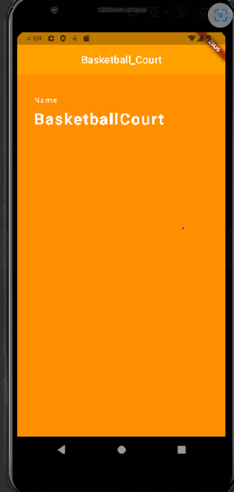

# colorpage

```dart
import 'package:flutter/material.dart';

void main() {
  // main 스레드는 runApp을 실행시키고 종료된다.
  runApp(FirstApp());
}
class FirstApp extends StatelessWidget {
  @override
  Widget build(BuildContext context) {
    return MaterialApp(
      title: 'First App',
      home: MyHomePage(),
    );
  }
}
class MyHomePage extends StatelessWidget {
  // const MyHomePage({super.key});
  @override
  Widget build(BuildContext context) {
    return Scaffold(
      backgroundColor: Colors.amber[800],
      appBar: AppBar(
        title: Text("Basketball_Court"),
        backgroundColor: Colors.amber[700],
        centerTitle: true,
        elevation: 0.0,
      ),
      body: Padding(
        padding: EdgeInsets.fromLTRB(30.0, 40.0, 0.0, 0.0),
        child: Column(
          crossAxisAlignment: CrossAxisAlignment.start,
          children: [
            Text('Name',
              style: TextStyle(
                color:Colors.white,
                letterSpacing: 2.0,
              ),
            ),
            SizedBox(
              height: 10.0,
            ),
            Text('BasketballCourt',
            style: TextStyle(
              color: Colors.white,
              letterSpacing: 2.0,
              fontSize: 30.0,
              fontWeight: FontWeight.bold
            ),
            ),
          ],
        )
      ),
    );
  }
}

```

<!--  -->

