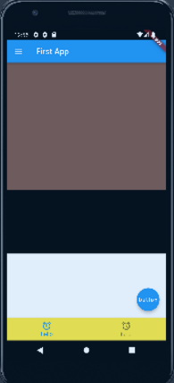

# column flex

```dart
import 'package:flutter/material.dart';
import 'dart:io';
// Duration을 위한 import

void main() {
  // main 스레드는 runApp을 실행시키고 종료된다.
  runApp(FirstApp());
  // runApp(const MyApp());
  sleep(Duration(seconds:3));
  // 비동기 느낌
  print('main terminate');
}
class FirstApp extends StatelessWidget {
  @override
  Widget build(BuildContext context) {
    return MaterialApp(
      home: SafeArea(
        child:Scaffold(
          appBar: AppBar(
            backgroundColor: Colors.blue,
            title: Text('First App'),
            leading:Icon(Icons.menu),
          ),
          body:Column(
            // 기본 크기가 없기에 높이를 넣어줘야한다.

            children:[
              Expanded(
                flex: 2,
                // alt enter로 초월되지 않게 팽창시켜주는 방법
                // 1:1:1로 확장하고 싶으면 실 높이는 필요없이 expanded를 다 해주면된다.
                // 비율은 flex로 조절할 수 있다.
                child: Container(
                  // 현재 제약 조건이 부모 최대 크기 까지
                  color:Colors.brown,
                ),
              ),
              Expanded(
                flex: 1,
                child: Container(
                  color:Colors.black,
                ),
              ),
              Expanded(
                flex: 1,
                child: Container(
                  color:Colors.white,
                ),
              ),
            ],
          ),
          floatingActionButton: FloatingActionButton(
            child: Text("button"),
            onPressed: () {
              print('button clicked');
            },
          ),
          bottomNavigationBar: BottomNavigationBar(
            items:[
              BottomNavigationBarItem(
                label:"hello",
                icon:Icon(
                  Icons.access_alarm_rounded
              )),
              BottomNavigationBarItem(
              label:"hello",
              icon:Icon(
                Icons.access_alarm_rounded
              )),
            ],
          backgroundColor:Colors.yellow,
        ),
      ),
      ));
  }
}

```
