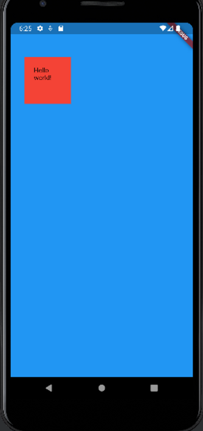

# container widget

```dart
import 'package:flutter/material.dart';

void main() => runApp(MyApp());

class MyApp extends StatelessWidget {
  @override
  Widget build(BuildContext context) {
    return MaterialApp(
      title: 'Myapp',
      theme: ThemeData(
        primaryColor: Colors.blue
      ),
      home: MyPage(),
    );
  }
}

class MyPage extends StatelessWidget {
  @override
  Widget build(BuildContext context) {
    return Scaffold(
      backgroundColor: Colors.blue,
      body: SafeArea(
        child: Container(
          color: Colors.red,
          width: 100,
          height: 100,
          margin: EdgeInsets.symmetric(
            vertical: 50,
            horizontal: 30,
          ),
          padding: EdgeInsets.all(20.0),
          child: Text('Hello world!'),
        ),
      ),
    );
  }
}

```


