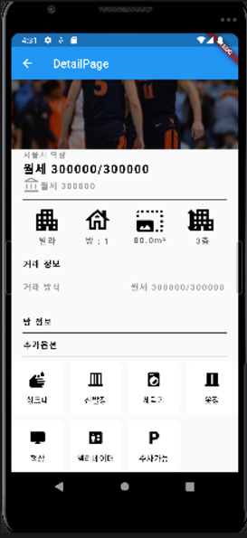

# json 형식에 따라 container shrink 하기


- 관리비가 존재하는 파일이면 보여주고 json에 없다면 최대한 작게 만든다.

```dart
Container(
  alignment: Alignment.centerLeft,
  padding: EdgeInsets.only(left: 20, bottom: 20),
  child: Row(
    children: [
      Expanded(
        child: houseList['contractInfo']['maintenance'] != null
            ? Container(
          alignment: Alignment.centerLeft,
          child: Text(
            '관리비',
            style: TextStyle(
              color: Colors.grey[500],
              letterSpacing: 2.0,
              fontWeight: FontWeight.bold,
            ),
          ),
        )
            : SizedBox.shrink(),
      ),
      Expanded(
        child: houseList['contractInfo']['maintenance'] != null
            ? Container(
          alignment: Alignment.centerLeft,
          child: Text(
            '관리비 ' + houseList['contractInfo']['maintenance'].toString(),
            style: TextStyle(
              color: Colors.grey[500],
              letterSpacing: 2.0,
              fontWeight: FontWeight.bold,
            ),
          ),
        )
            : SizedBox.shrink(),
      ),
    ],
  ),
)
```



