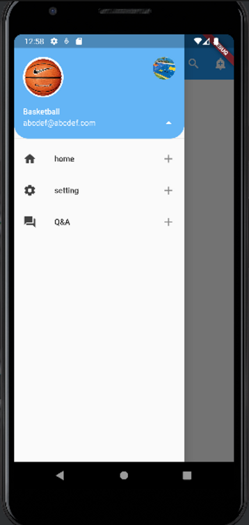

# drawer with list

```dart
import 'package:flutter/material.dart';

void main() {
  // main 스레드는 runApp을 실행시키고 종료된다.
  runApp(FirstApp());
}
class FirstApp extends StatelessWidget {
  @override
  Widget build(BuildContext context) {
    return MaterialApp(
      title: 'First App',
      theme: ThemeData(
        primaryColor: Colors.blue,
      ),
      home: MyHomePage(),
    );
  }
}

class MyHomePage extends StatelessWidget {
  // const MyHomePage({super.key});
  @override
  Widget build(BuildContext context) {
    return Scaffold(
      appBar: AppBar(
        title: Text('AppBar icon menu'),
        centerTitle: true,
        elevation: 0.0,
        actions: [
          // IconButton(
          //     onPressed: () {print('cart pressed');},
          //     icon: Icon(Icons.shopping_cart)),
          IconButton(
              onPressed: () {print('unit pressed');},
              icon: Icon(Icons.search)),
          IconButton(
              onPressed: () {print('alarm pressed');},
              icon: Icon(Icons.add_alert_sharp)),
        ],
      ),
      drawer: Drawer(
        child: ListView(
          padding: EdgeInsets.zero,
          children: [
            UserAccountsDrawerHeader(
                currentAccountPicture: CircleAvatar(
                  backgroundImage: AssetImage('assets/ball.png'),
                  backgroundColor: Colors.white,
                ),
                otherAccountsPictures: [
                  CircleAvatar(
                    backgroundImage: AssetImage('assets/basketball_court.png'),
                    backgroundColor: Colors.white,
                  ),
                  // CircleAvatar(
                  //   backgroundImage: AssetImage('assets/basketball_court.png'),
                  //   backgroundColor: Colors.white,
                  // ),
                ],
                accountName: Text("Basketball"),
                accountEmail: Text("abcdef@abcdef.com"),
              onDetailsPressed: () {
                  print('arrow is clicked');
              },
              decoration: BoxDecoration(
                color: Colors.blue[300],
                borderRadius: BorderRadius.only(
                  bottomLeft: Radius.circular(25.0),
                  bottomRight: Radius.circular(25.0)
                )
              ),
            ),
            ListTile(
              leading: Icon(Icons.home,
              color: Colors.grey[800],
              ),
              title: Text('home'),
              onTap: (){
                print('home button clicked');
              },
              trailing: Icon(Icons.add),
            ),
            ListTile(
              leading: Icon(Icons.settings,
                color: Colors.grey[800],
              ),
              title: Text('setting'),
              onTap: (){
                print('Setting button clicked');
              },
              trailing: Icon(Icons.add),
            ),
            ListTile(
              leading: Icon(Icons.question_answer,
                color: Colors.grey[800],
              ),
              title: Text('Q&A'),
              onTap: (){
                print('Q&A button clicked');
              },
              trailing: Icon(Icons.add),
            )

          ],
        ),
      ),
    );
  }
}

```

