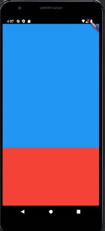

# expanded_mediaquery

- 기본적으로 높이나 길이 등을 설정할 수 있다.
- 하지만 device마다 크기가 다르기에 expanded를 설정할 수 있다.

```dart
import 'package:flutter/material.dart';
import 'dart:io';
// Duration을 위한 import

void main() {
  // main 스레드는 runApp을 실행시키고 종료된다.
  runApp(FirstApp());
  // runApp(const MyApp());
  // sleep(Duration(seconds:3));
  // 비동기 느낌
  print('main terminate');
}
class FirstApp extends StatelessWidget {
  @override
  Widget build(BuildContext context) {
    return MaterialApp(
      home: SafeArea(
        child: Scaffold(
          body: Column(
            children: [
              Container(
                height:500,
                // device마다 비율이 달라 추천하지 않는다.
                color:Colors.blue,
              ),
              Expanded(
                flex: 1,
                child: Container(
                  color:Colors.red,
                ),
              ),
            ],
          ),
        ),
      ),
    );
  }
}

```



- 그리고 다른 방법으로는 MediaQuery
    - device의 크기를 알려준다.

```dart
import 'package:flutter/material.dart';
import 'dart:io';
// Duration을 위한 import

void main() {
  // main 스레드는 runApp을 실행시키고 종료된다.
  runApp(FirstApp());
  // runApp(const MyApp());
  // sleep(Duration(seconds:3));
  // 비동기 느낌
  print('main terminate');
}
class FirstApp extends StatelessWidget {
  @override
  Widget build(BuildContext context) {
    var m = MediaQuery.of(context);
    print("넓이 : ${m.size.width}");
    print("높이 : ${m.size.height}");
    print("safearea: ${m.padding.top}");
    // I/flutter ( 2011): 넓이 : 392.72727272727275
    // I/flutter ( 2011): 높이 : 759.2727272727273
    // 하지만 여백의 공간을 잡아먹기 때문에 원 사이즈를 사용하는 것은 비추
    return MaterialApp(
      home: SafeArea(
        child: Scaffold(
          body: Column(
            children: [
              Container(
                height:(m.size.height-24)*0.5,
                // device마다 비율이 달라 추천하지 않는다.
                color:Colors.blue,
              ),
              Container(
                height: (m.size.height-24)*0.5,
                color:Colors.red,
              ),
            ],
          ),
        ),
      ),
    );
  }
}
```