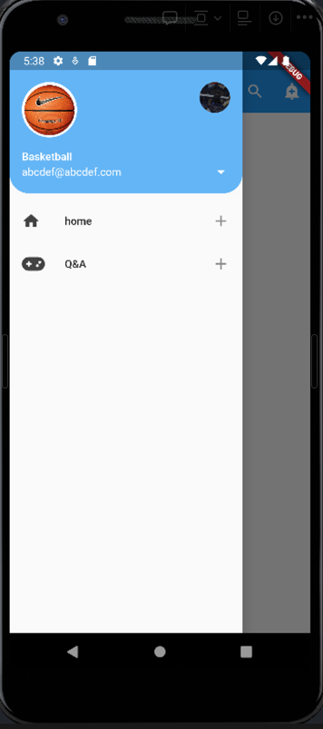

# flutter fontawesome

- FontAwesome
    - https://fontawesome.com/
- FontAwesome 라이브러리
    - https://pub.dev/packages/font_awesome_flutter/install
    - 현재 최신 version
    
    ```dart
    dependencies:
      font_awesome_flutter: ^10.5.0
    ```
    
    ```dart
    $ flutter pub get 을 dependencies를 가져온다.
    ```
    
    - import를 이모지 사용하는 각 페이지에서 해주고
        
        ```dart
        import 'package:font_awesome_flutter/font_awesome_flutter.dart';
        ```
        
    - 아이콘 삽입하는 방법
    
    ```dart
    Flacon(FontAwesomeIcons.ICONNAME
    ```
    
    - 아이콘을 사용한 drawer list
        - 일반적으로 사용할 수 있는 아이콘 vs fontawesome
    - listview를 하나 만들어보면

```dart
ListView(
          padding: EdgeInsets.zero,
          children: [
            UserAccountsDrawerHeader(
              currentAccountPicture: CircleAvatar(
                backgroundImage: AssetImage('assets/ball.png'),
                backgroundColor: Colors.white,
              ),
              otherAccountsPictures: [
                CircleAvatar(
                  backgroundImage: AssetImage('assets/img_1.png'),
                  backgroundColor: Colors.white,
                ),
              ],
              accountName: Text("Basketball"),
              accountEmail: Text("abcdef@abcdef.com"),
              onDetailsPressed: () {
                print('arrow is clicked');
              },
              decoration: BoxDecoration(
                color: Colors.blue[300],
                borderRadius: BorderRadius.only(
                  bottomLeft: Radius.circular(25.0),
                  bottomRight: Radius.circular(25.0),
                ),
              ),
            ),
            ListTile(
              leading: Icon(
                Icons.home,
// 요게 일반적으로 제공되는 Icon
                color: Colors.grey[800],
              ),
              title: Text('home'),
              onTap: (){
                print('home button clicked');
              },
              trailing: Icon(Icons.add),
            ),
            ListTile(
              leading: FaIcon(
                FontAwesomeIcons.gamepad,
// 요게 FontAwesome Icon
                color: Colors.grey[800],
              ),
              title: Text('Q&A'),
              onTap: (){
                print('Q&A button clicked');
              },
              trailing: Icon(Icons.add),
            ),
          ],
        ),
```

- 사용되는 방식이 다르니 참고하면서 사용하시길

  
