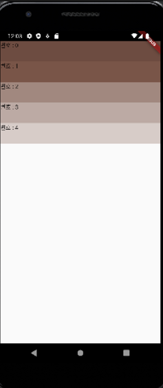

# listview

- 넘어가도 스크롤로 만들어준다.

```dart
import 'package:flutter/material.dart';
import 'dart:io';
// Duration을 위한 import

void main() {
  // main 스레드는 runApp을 실행시키고 종료된다.
  runApp(FirstApp());
  // runApp(const MyApp());
  // sleep(Duration(seconds:3));
  // 비동기 느낌
  print('main terminate');
}
class FirstApp extends StatelessWidget {
  final colorCodes = [600,500,300,200,100];

  @override
  Widget build(BuildContext context) {
    return MaterialApp(
      home: SafeArea(
        child: Scaffold(
          body: ListView.builder(
            // padding: EdgeInsets.all(10),
            itemCount:5,
            itemBuilder: (BuildContext, int index) {
          return Container(
            height:50,
            color:Colors.brown[colorCodes[index]],
            child:Text('번호 : ${index}')
          );
          },
          ),
        ),
      ),
    );
  }
}

```

