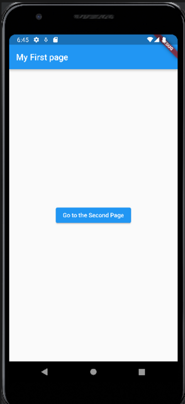

# navigator_router

```dart
import 'package:flutter/material.dart';

void main() => runApp(MyApp());

class MyApp extends StatelessWidget {
  @override
  Widget build(BuildContext context) {
    return MaterialApp(
      title: 'Myapp',
      theme: ThemeData(
        primaryColor: Colors.blue
      ),
      home: MyPage(),
    );
  }
}

class MyPage extends StatelessWidget {
  @override
  Widget build(BuildContext context2) {
    return Scaffold(
      appBar: AppBar(
        title: Text('My First page')
      ),
      body: Center(
        child: ElevatedButton(
          child: Text('Go to the Second Page'),
          onPressed: () {
            Navigator.push(context2, MaterialPageRoute(
                builder: (context) => SecondPage()));
          },
        ),
      ),
    );
  }
}

class SecondPage extends StatelessWidget {

  @override
  Widget build(BuildContext context) {
    return Scaffold(
      appBar: AppBar(
          title: Text('My Second page')
      ),
      body: Center(
        child: ElevatedButton(
          child: Text('Go to the First Page'),
          onPressed: () {
            Navigator.pop(context);
          },
        ),
      ),
    );
  }
}

```


