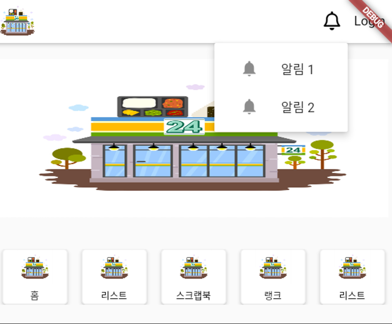

# appbar에서 popover가 나오도록

```dart
import 'package:flutter/material.dart';
import 'package:font_awesome_flutter/font_awesome_flutter.dart';
import 'package:go_router/go_router.dart';

class CustomAppBar extends StatelessWidget implements PreferredSizeWidget {
  @override
  Size get preferredSize => Size.fromHeight(kToolbarHeight);

  const CustomAppBar({Key? key}) : super(key: key);

  @override
  Widget build(BuildContext context) {
    final goRouter = GoRouter.of(context);

    return AppBar(
      backgroundColor: Colors.white,
      leading: GestureDetector(
        onTap: () {
          goRouter.go('/'); // 홈 페이지로 이동
        },
        child: Image.asset('assets/images/cvs.jpg'),
      ),
      actions: [
        PopupMenuButton(
          icon: Icon(
            FontAwesomeIcons.bell,
            color: Colors.black,
          ),
          offset: Offset(0, kToolbarHeight), // 이 옵션을 사용하여 팝업 메뉴의 위치를 조정합니다.
          itemBuilder: (BuildContext context) {
            return <PopupMenuEntry>[
              PopupMenuItem(
                child: ListTile(
                  leading: Icon(Icons.notifications),
                  title: Text('알림 1'),
                  onTap: () {
                    // 예: goRouter.go('/notification/1');
                    goRouter.go('/scrapbook');
                  },
                ),
              ),
              PopupMenuItem(
                child: ListTile(
                  leading: Icon(Icons.notifications),
                  title: Text('알림 2'),
                  onTap: () {
                    goRouter.go('/scrapbook');
                  },
                ),
              ),
              // 원하는 만큼 팝업 메뉴 아이템을 추가할 수 있습니다.
            ];
          },
        ),
        TextButton(
          onPressed: () {
            goRouter.go('/login'); // 로그인 페이지로 이동
          },
          child: Text(
            'Login',
            style: TextStyle(
              color: Colors.black,
              fontSize: 16,
            ),
          ),
        ),
      ],
    );
  }
}

```


