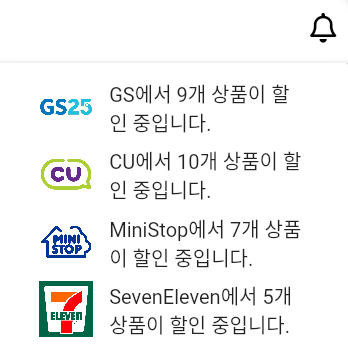

# popover

```dart
PopupMenuButton(
          icon: Icon(
            FontAwesomeIcons.bell,
            color: Colors.black,
          ),
          offset: Offset(0, kToolbarHeight), // 이 옵션을 사용하여 팝업 메뉴의 위치를 조정합니다.
          itemBuilder: (BuildContext context) {
            return <PopupMenuEntry>[
              PopupMenuItem(
                child: ListTile(
                  leading: Image.asset(
                    'assets/images/gs.jpg',
                    width: 45,
                    height: 45,
                  ),
                  title: Text('GS에서 9개 상품이 할인 중입니다.'),
                  onTap: () {
                    // 예: goRouter.go('/notification/1');
                    goRouter.go('/product_list_page');
                  },
                ),
              ),
              PopupMenuItem(
                child: ListTile(
                  leading: Image.asset(
                    'assets/images/cu.png',
                    width: 45,
                    height: 45,
                  ),
                  title: Text('CU에서 10개 상품이 할인 중입니다.'),
                  onTap: () {
                    goRouter.go('/product_list_page');
                  },
                ),
              ),
              PopupMenuItem(
                child: ListTile(
                  leading: Image.asset(
                    'assets/images/ministop.png',
                    width: 45,
                    height: 45,
                  ),
                  title: Text('MiniStop에서 7개 상품이 할인 중입니다.'),
                  onTap: () {
                    goRouter.go('/product_list_page');
                  },
                ),
              ),
              PopupMenuItem(
                child: ListTile(
                  leading: Image.asset(
                    'assets/images/seveneleven.png',
                    width: 45,
                    height: 45,
                  ),
                  title: Text('SevenEleven에서 5개 상품이 할인 중입니다.'),
                  onTap: () {
                    goRouter.go('/product_list_page');
                  },
                ),
              )

              // 원하는 만큼 팝업 메뉴 아이템을 추가할 수 있습니다.
            ];
          },
        ),
```

- 이걸 컴포넌트화 시키면

```python
import 'package:flutter/material.dart';
import 'package:go_router/go_router.dart';
import 'package:font_awesome_flutter/font_awesome_flutter.dart';

class AlarmButton extends StatelessWidget {
  const AlarmButton({Key? key});

  @override
  Widget build(BuildContext context) {
    final GoRouter goRouter = GoRouter.of(context);

    return PopupMenuButton(
      icon: Icon(
        FontAwesomeIcons.bell,
        color: Colors.black,
      ),
      offset: Offset(0, kToolbarHeight), // 이 옵션을 사용하여 팝업 메뉴의 위치를 조정합니다.
      itemBuilder: (BuildContext context) {
        return <PopupMenuEntry>[
          _buildPopupMenuItem(
            imageAsset: 'assets/images/gs.jpg',
            text: 'GS에서 9개 상품이 할인 중입니다.',
            route: '/product_list_page',
            goRouter: goRouter,
          ),
          _buildPopupMenuItem(
            imageAsset: 'assets/images/cu.png',
            text: 'CU에서 10개 상품이 할인 중입니다.',
            route: '/product_list_page',
            goRouter: goRouter,
          ),
          _buildPopupMenuItem(
            imageAsset: 'assets/images/ministop.png',
            text: 'MiniStop에서 7개 상품이 할인 중입니다.',
            route: '/product_list_page',
            goRouter: goRouter,
          ),
          _buildPopupMenuItem(
            imageAsset: 'assets/images/seveneleven.png',
            text: 'SevenEleven에서 5개 상품이 할인 중입니다.',
            route: '/product_list_page',
            goRouter: goRouter,
          ),
        ];
      },
    );
  }

  PopupMenuItem _buildPopupMenuItem({
    required String imageAsset,
    required String text,
    required String route,
    required GoRouter goRouter,
  }) {
    return PopupMenuItem(
      child: ListTile(
        leading: Image.asset(
          imageAsset,
          width: 45,
          height: 45,
        ),
        title: Text(text),
        onTap: () {
          goRouter.go(route);
        },
      ),
    );
  }
}
```


