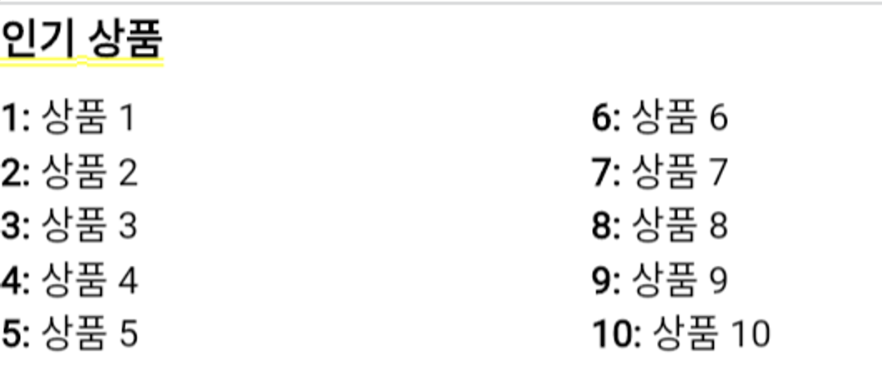

# ranking widget

```dart
import 'package:flutter/material.dart';

class Rank extends StatelessWidget {
  final List<String> rankList = [
    '상품 1', '상품 2', '상품 3', '상품 4', '상품 5',
    '상품 6', '상품 7', '상품 8', '상품 9', '상품 10'
  ];

  @override
  Widget build(BuildContext context) {
    return Column(
      crossAxisAlignment: CrossAxisAlignment.start,
      children: [
        Text(
          '인기 상품',
          style: TextStyle(
            fontSize: 20,
            fontWeight: FontWeight.bold,
            color: Colors.black,
          ),
        ),
        SizedBox(height: 10),
        Row(
          children: [
            Expanded(
              child: Column(
                crossAxisAlignment: CrossAxisAlignment.start,
                children: rankList.sublist(0, 5).asMap().entries.map((entry) {
                  final int index = entry.key + 1;
                  final String rank = entry.value;
                  return RichText(
                    text: TextSpan(
                      children: <TextSpan>[
                        TextSpan(
                          text: '$index: ',
                          style: TextStyle(
                            fontSize: 18,
                            fontWeight: FontWeight.bold, // index 텍스트 굵게 표시
                            color: Colors.black,
                          ),
                        ),
                        TextSpan(
                          text: '$rank', // 나머지 텍스트
                          style: TextStyle(
                            fontSize: 18,
                            color: Colors.black,
                          ),
                        ),
                      ],
                    ),
                  );
                }).toList(),
              ),
            ),
            SizedBox(width: 20), // 오른쪽과의 간격 조절
            Expanded(
              child: Column(
                crossAxisAlignment: CrossAxisAlignment.start,
                children: rankList.sublist(5).asMap().entries.map((entry) {
                  final int index = entry.key + 6;
                  final String rank = entry.value;
                  return RichText(
                    text: TextSpan(
                      children: <TextSpan>[
                        TextSpan(
                          text: '$index: ',
                          style: TextStyle(
                            fontSize: 18,
                            fontWeight: FontWeight.bold, // index 텍스트 굵게 표시
                            color: Colors.black,
                          ),
                        ),
                        TextSpan(
                          text: '$rank', // 나머지 텍스트
                          style: TextStyle(
                            fontSize: 18,
                            color: Colors.black,
                          ),
                        ),
                      ],
                    ),
                  );
                }).toList(),
              ),
            ),
          ],
        ),
      ],
    );
  }
}

```


