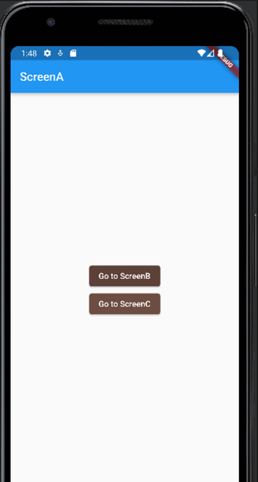

# router lib

- lib/main.dart

```dart
import 'package:flutter/material.dart';
import 'package:flutter_prac1/ScreenA.dart';
import 'package:flutter_prac1/ScreenB.dart';
import 'package:flutter_prac1/ScreenC.dart';

void main() => runApp(MyApp());

class MyApp extends StatelessWidget {
  @override
  Widget build(BuildContext context) {
    return MaterialApp(
      initialRoute: '/',
      routes: {
        '/' : (context) => ScreenA(),
        '/b': (context) => ScreenB(),
        '/c': (context) => ScreenC(),
      },
    );
  }
}

```

- lib/ScreenA

```dart
import 'package:flutter/material.dart';

class ScreenA extends StatelessWidget {

  @override
  Widget build(BuildContext context) {
    return Scaffold(
      appBar: AppBar(
        title: Text('ScreenA'),
      ),
      body: Center(
        child: Column(
          mainAxisAlignment: MainAxisAlignment.center,
          children: [
            ElevatedButton(
              onPressed: (){
                Navigator.pushNamed(context, '/b');
              },
              child: Text('Go to ScreenB'),
              style: ElevatedButton.styleFrom(
                primary: Colors.brown[700],
              ),
            ),
            ElevatedButton(
              onPressed: (){
                Navigator.pushNamed(context, '/c');
              },
              child: Text('Go to ScreenC'),
              style: ElevatedButton.styleFrom(
                primary: Colors.brown[600]
              ),
            ),
          ],
        ),
      ),

    );
  }
}

```

- lib/ScreenB

```dart
import 'package:flutter/material.dart';

class ScreenB extends StatelessWidget {

  @override
  Widget build(BuildContext context) {
    return Scaffold(
      appBar: AppBar(
        title: Text('ScreenB'),

      ),
      body: Center(
        child: Text('ScrrenB',
        style: TextStyle(
          fontSize: 25.0
        ),
        ),
      ),
    );
  }
}

```

- lib/ScreenC

```dart
import 'package:flutter/material.dart';

class ScreenC extends StatelessWidget {

  @override
  Widget build(BuildContext context) {
    return Scaffold(
      appBar: AppBar(
        title: Text('ScreenC'),

      ),
      body: Center(
        child: Text('ScrrenC',
          style: TextStyle(
              fontSize: 25.0
          ),
        ),
      ),
    );
  }
}

```


