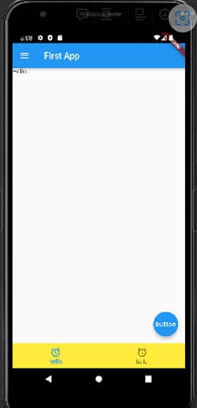

# scaffold

```dart
import 'package:flutter/material.dart';
import 'dart:io';
// Duration을 위한 import

void main() {
  // main 스레드는 runApp을 실행시키고 종료된다.
  runApp(FirstApp());
  // runApp(const MyApp());
  sleep(Duration(seconds:3));
  // 비동기 느낌
  print('main terminate');
}
class FirstApp extends StatelessWidget {
  @override
  Widget build(BuildContext context) {
    return MaterialApp(
      home: SafeArea(
        child:Scaffold(
          appBar: AppBar(
            backgroundColor: Colors.blue,
            title: Text('First App'),
            leading:Icon(Icons.menu),
          ),
          body:Text("Hello"),
          floatingActionButton: FloatingActionButton(
            child: Text("button"),
            onPressed: () {
              print('button clicked');
            },
          ),
          bottomNavigationBar: BottomNavigationBar(
            items:[
              BottomNavigationBarItem(
                label:"hello",
                icon:Icon(
                  Icons.access_alarm_rounded
              )),
              BottomNavigationBarItem(
              label:"hello",
              icon:Icon(
                Icons.access_alarm_rounded
              )),
            ],
          backgroundColor:Colors.yellow,
        ),
      ),
      ));
  }
}
```

