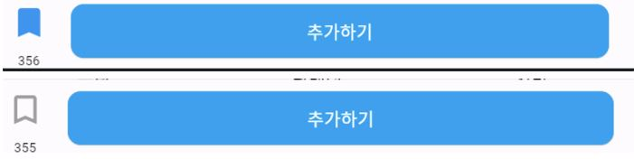

# 버튼을 눌렸을 떄 색상과 숫자 관리하기

```dart
import 'package:flutter/material.dart';

class PlusNavBar extends StatefulWidget {
  const PlusNavBar({Key? key});

  @override
  _PlusNavBarState createState() => _PlusNavBarState();
}

class _PlusNavBarState extends State<PlusNavBar> {
  int itemCount = 355;
  bool isBookmarked = false;

  @override
  Widget build(BuildContext context) {
    return Container(
      height: 60,
      child: Row(
        children: [
          Column(
            children: [
              Expanded(
                child: IconButton(
                  onPressed: () {
                    setState(() {
                      // 아이콘 클릭 시 상태를 변경합니다.
                      isBookmarked = !isBookmarked;
                      if (isBookmarked) {
                        itemCount++;
                      } else {
                        itemCount--;
                      }
                    });
                  },
                  icon: Icon(
                    isBookmarked
                        ? Icons.bookmark
                        : Icons.bookmark_outline,
                    color: isBookmarked
                        ? Colors.blue
                        : Colors.grey,
                    size: 30,
                  ),
                ),
              ),
              Text(
                '$itemCount',
                style: TextStyle(
                  fontSize: 10,
                ),
              ),
            ],
          ),
          SizedBox(width: 10,),
          Expanded(
            child: ElevatedButton(
              onPressed: () {
                // 추가하기 버튼이 눌렸을 때의 동작
              },
              style: ElevatedButton.styleFrom(
                primary: Colors.lightBlue,
                shape: RoundedRectangleBorder(
                  borderRadius: BorderRadius.circular(10.0),
                ),
                minimumSize: Size(300, 50),
              ),
              child: Text(
                '추가하기',
                style: TextStyle(
                  color: Colors.white,
                ),
              ),
            ),
          ),
          SizedBox(width: 20,),
        ],
      ),
    );
  }
}
```


