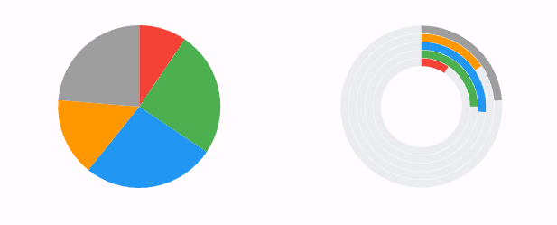

# Flutter syncfusion_chart

- dependency를 활용해서 chart로 데이터를 표현해보자
    - [syncfusion_flutter_charts | Flutter Package (pub.dev)](https://pub.dev/packages/syncfusion_flutter_charts/install)
    - [Flutter Charts | Beautiful & Interactive Live Charts | Syncfusion](https://www.syncfusion.com/flutter-widgets/flutter-charts)
- 

```dart
import 'package:flutter/material.dart';
import 'package:go_router/go_router.dart';
import 'package:frontend/molecules/appbar.dart';
import 'package:frontend/molecules/top_bar_main.dart';
import 'package:syncfusion_flutter_charts/charts.dart';
import 'package:syncfusion_flutter_charts/sparkcharts.dart';

class ProductDetailPage extends StatefulWidget {
  const ProductDetailPage({Key? key}) : super(key: key);

  @override
  _ProductDetailPageState createState() => _ProductDetailPageState();
}

class _ProductDetailPageState extends State<ProductDetailPage> {
  Map<String, dynamic> ProductDetail = {
    'productName': '남양)프렌치카푸치노200ml',
    'price': 2700,
    'filename': 'assets/images/coffee.png',
    'badge': '배지',
    'category': 1,
    'favoriteCount': 42,
    'weight': 200,
    'kcal': 150,
    'carb': 20.5,
    'protein': 10.0,
    'fat': 5.0,
    'sodium': 300.0,
    'comments': [
      {
        'nickname': 'abc',
        'content': '좋아요!',
        'createdAt': '2023-09-15',
      },
      {
        'nickname': 'abcd',
        'content': '맛있어요!',
        'createdAt': '2023-09-16',
      },
    ],
  };

  Map<String, dynamic> StandardDetail = {
    'kcal': 2500,
    'carb': 130,
    'protein': 60,
    'fat': 51.0,
    'sodium': 2000.0,
  };

  List<ChartData> chartData = [];

  @override
  void initState() {
    super.initState();
    chartData = [
      ChartData('kcal', 150 / StandardDetail['kcal'], Colors.red),
      ChartData('carb', 20.5 / StandardDetail['carb'], Colors.green),
      ChartData('protein', 10 / StandardDetail['protein'], Colors.blue),
      ChartData('fat', 5.0 / StandardDetail['fat'], Colors.orange),
      ChartData('sodium', 300 / StandardDetail['sodium'], Colors.grey),
    ];
  }

  @override
  Widget build(BuildContext context) {
    return Container(
      child: Scaffold(
        appBar: TopBarMain(appBar: AppBar(),),
        body: ListView(
          children: [
            Container(
              width: double.infinity,
              height: 350,
              padding: EdgeInsets.only(left: 20),
              child: Image.asset(
                'assets/images/coffee.jpg',
                fit: BoxFit.cover,
              ),
            ),
         
           
            Row(
              children: [

// 원형 차트
                Container(
                  height: 200,
                  width: 250,
                  child: Container(
                      child: SfCircularChart(
                          series: <CircularSeries>[
                            // Render pie chart
                            PieSeries<ChartData, String>(
                                dataSource: chartData,
                                pointColorMapper:(ChartData data, _) => data.color,
                                xValueMapper: (ChartData data, _) => data.x,
                                yValueMapper: (ChartData data, _) => data.y
                            )
                          ]
                      )
                  ),
                ),

// 원형 바 차트
                Container(
                  height: 200,
                  width: 250,
                  child: Container(
                      child: SfCircularChart(
                          series: <CircularSeries>[
                            // Render pie chart
                            RadialBarSeries<ChartData, String>(
                                dataSource: chartData,
                                pointColorMapper:(ChartData data, _) => data.color,
                                xValueMapper: (ChartData data, _) => data.x,
                                yValueMapper: (ChartData data, _) => data.y
                            )
                          ]
                      )
                  ),
                ),
              ],
            ),
          ],
        ),
      ),
    );
  }
}

class ChartData {
  ChartData(this.x, this.y, this.color);
  final String x;
  final double y;
  final Color color;
}
```


