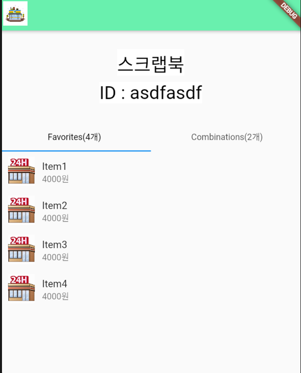
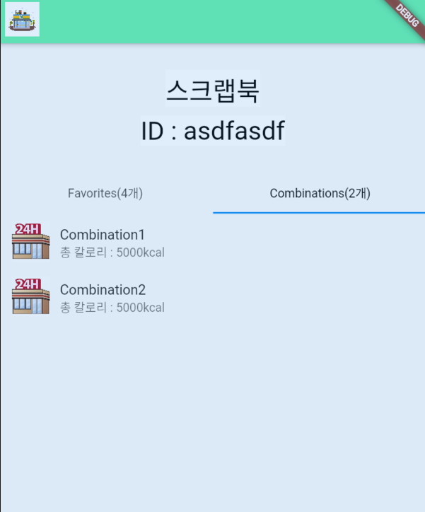

# tabbar listview

```dart
import 'package:flutter/material.dart';
import 'package:go_router/go_router.dart';

class ScrapBook extends StatefulWidget {
  const ScrapBook({Key? key}) : super(key: key);

  @override
  _ScrapBookState createState() => _ScrapBookState();
}

class _ScrapBookState extends State<ScrapBook> {
  // 샘플 데이터
  List<Map<String, dynamic>> favorites = [
    {'productId': 'Long1', 'name': 'Item1', 'price': '4000', 'filename': 'String1', 'badge': 'String1', 'imagePath': 'assets/images/supermarket.png'},
    {'productId': 'Long2', 'name': 'Item2', 'price': '4000', 'filename': 'String2', 'badge': 'String2', 'imagePath': 'assets/images/supermarket.png'},
    {'productId': 'Long3', 'name': 'Item3', 'price': '4000', 'filename': 'String3', 'badge': 'String3', 'imagePath': 'assets/images/supermarket.png'},
    {'productId': 'Long4', 'name': 'Item4', 'price': '4000', 'filename': 'String4', 'badge': 'String4', 'imagePath': 'assets/images/supermarket.png'},
  ];

  List<Map<String, dynamic>> combinations = [
    {
      'name': 'Combination1',
      'total_price': '20000',
      'total_kcal': '5000',
      'total_carb': '5000',
      'total_protein': '5000',
      'total_fat': '5000',
      'total_sodium': '5000',
      'CombinationItems': [
        {'productId': 'Long5', 'name': 'Item5', 'price': '4000', 'imagePath': 'assets/images/supermarket.png', 'amounts': '500'},
        {'productId': 'Long6', 'name': 'Item6', 'price': '4000', 'imagePath': 'assets/images/supermarket.png', 'amounts': '500'},
        {'productId': 'Long7', 'name': 'Item7', 'price': '4000', 'imagePath': 'assets/images/supermarket.png', 'amounts': '500'},
      ]
    },
    {
      'name': 'Combination2',
      'total_price': '20000',
      'total_kcal': '5000',
      'total_carb': '5000',
      'total_protein': '5000',
      'total_fat': '5000',
      'total_sodium': '5000',
      'CombinationItems': [
        {'productId': 'Long8', 'name': 'Item8', 'price': '4000', 'imagePath': 'assets/images/supermarket.png', 'amounts': '500'},
        {'productId': 'Long9', 'name': 'Item9', 'price': '4000', 'imagePath': 'assets/images/supermarket.png', 'amounts': '500'},
        {'productId': 'Long10', 'name': 'Item10', 'price': '4000', 'imagePath': 'assets/images/supermarket.png', 'amounts': '500'},
      ]
    },
  ];

  @override
  Widget build(BuildContext context) {
    return DefaultTabController(
      length: 2, // 탭의 수
      child: Scaffold(
        appBar: AppBar(
          backgroundColor: Colors.greenAccent,
          leading: IconButton(
            icon: Image.asset('assets/images/cvs.jpg'),
            onPressed: () {
              context.go('/');
            },
          ),
          // actions: [
          //   TextButton(
          //     onPressed: () {
          //       context.push('/login');
          //     },
          //     child: Text('Login', style: TextStyle(color: Colors.white)),
          //   ),
          // ],
        ),
        body: Column(
          children: [
            Container(
              height: 150,
              child: Center( // 텍스트를 중앙 정렬합니다.
                child: Column(
                  mainAxisAlignment: MainAxisAlignment.center,
                  children: [
                    Text(
                      '스크랩북',
                      style: TextStyle(
                        color: Colors.black,
                        fontSize: 30,
                        backgroundColor: Colors.white,
                      ),
                    ),
                    SizedBox(height: 10),
                    Text(
                      'ID : asdfasdf',
                      style: TextStyle(
                        color: Colors.black,
                        fontSize: 30,
                        backgroundColor: Colors.white,
                      ),
                    )
                  ],
                ),
              ),
            ),

            TabBar(
              labelColor: Colors.black,
              tabs: [
                Tab(text: 'Favorites' + '(${favorites.length}개)'),
                Tab(text: 'Combinations' + '(${combinations.length}개)'),
              ],

          ),
            Expanded(
              child: TabBarView(
                children: [
                  // Favorites 탭의 내용
                  ListView.builder(
                    itemCount: favorites.length,
                    itemBuilder: (context, index) {
                      final item = favorites[index];
                      return ListTile(
                        title: Text(item['name']),
                        subtitle: Text('${item['price']}' + '원'),
                        leading: Image.asset(item['imagePath']),
                        // 원하는 정보를 표시
                      );
                    },
                  ),

                  // Combinations 탭의 내용
                  ListView.builder(
                    itemCount: combinations.length,
                    itemBuilder: (context, index) {
                      final combination = combinations[index];
                      return Column(
                        children: [
                          ListTile(
                            title: Text(combination['name']),
                            subtitle: Text('총 칼로리 : ' + '${combination['total_kcal']}' + 'kcal'),
                            leading: Image.asset(combination['CombinationItems'][0]['imagePath']),

                            // 원하는 정보를 표시
                            ),
                          ],
                        );
                      },
                    ),
                  ],
                ),
              ),
                ],
              ),
            ),

    );
  }
}

```




