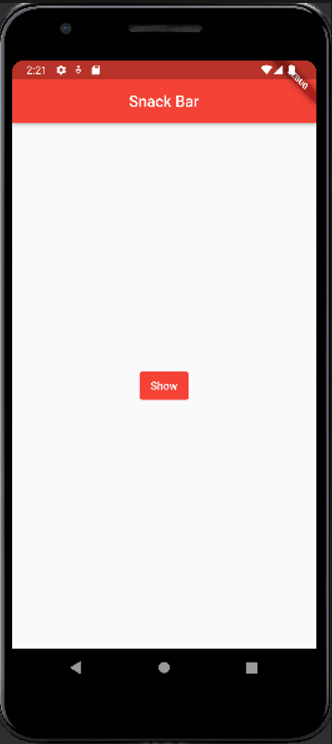

# textbutton_scaffoldmessenger

```dart
import 'package:flutter/material.dart';

void main() => runApp(MyApp());

class MyApp extends StatelessWidget {
  @override
  Widget build(BuildContext context) {
    return MaterialApp(
      title: 'Snack Bar',
      theme: ThemeData(
        primarySwatch: Colors.red
      ),
      home: NewPage(),
    );
  }
}

class NewPage extends StatelessWidget {
  @override
  Widget build(BuildContext context) {
    return Scaffold(
      appBar: AppBar(
        title: Text('Snack Bar'),
        centerTitle: true,
      ),
      body: Center(
        child: TextButton(
          child: Text('Show',
          style: TextStyle(color: Colors.white),
          ),
          onPressed: () {
            ScaffoldMessenger.of(context).showSnackBar(SnackBar(
              content: Text('Hello world'),
        ));
        },
          style: ButtonStyle(
            backgroundColor: MaterialStateProperty.all<Color>(Colors.red),
          ),
        ),
      ),
    );
  }
}

```

- body : builder를 사용하여 표현

```dart
import 'package:flutter/material.dart';

void main() => runApp(MyApp());

class MyApp extends StatelessWidget {
  @override
  Widget build(BuildContext context) {
    return MaterialApp(
      title: 'Snack Bar',
      theme: ThemeData(
        primarySwatch: Colors.red
      ),
      home: NewPage(),
    );
  }
}

class NewPage extends StatelessWidget {
  @override
  Widget build(BuildContext context) {
    return Scaffold(
      appBar: AppBar(
        title: Text('Snack Bar'),
        centerTitle: true,
      ),
      body: Builder(builder: (BuildContext context) {
        return Center(
            child: TextButton(
              child: Text('Show',
                style: TextStyle(color: Colors.white),
              ),
              onPressed: () {
                ScaffoldMessenger.of(context).showSnackBar(SnackBar(
                  content: Text('Hello world'),
                ));
              },
              style: ButtonStyle(
                backgroundColor: MaterialStateProperty.all<Color>(Colors.red),
              ),
            ),
          );
        },
      ));
  }
}

```

