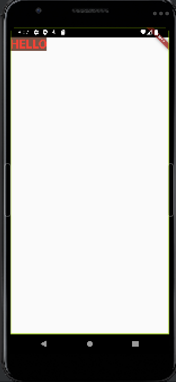
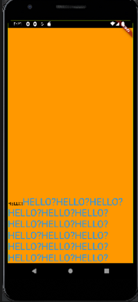

# textwidget

```dart
import 'package:flutter/material.dart';

void main() {
  // main 스레드는 runApp을 실행시키고 종료된다.
  runApp(FirstApp());
}
class FirstApp extends StatelessWidget {
  @override
  Widget build(BuildContext context) {
    return MaterialApp(
      home: SafeArea(
        child: Scaffold(
          body: Text(
            'HELLO',
            style: TextStyle(
              color:Colors.red,
              fontSize: 30,
              backgroundColor: Colors.brown,
              fontWeight: FontWeight.w800,
            ),
          ),
        ),
      ),
    );
  }
}

```



```dart
import 'package:flutter/material.dart';

void main() {
  // main 스레드는 runApp을 실행시키고 종료된다.
  runApp(FirstApp());
}
class FirstApp extends StatelessWidget {
  @override
  Widget build(BuildContext context) {
    return MaterialApp(
      home: SafeArea(
        child: Scaffold(
          body: Container(
            height:double.infinity,
            width: double.infinity,
            color:Colors.orange,
            alignment: Alignment(1.0, 1.0),
            child: Text.rich(
              TextSpan(
                children: [
                  TextSpan(text: 'HELLO!'),
                  TextSpan(text: 'HELLO?HELLO?HELLO?HELLO?HELLO?HELLO?HELLO?HELLO?HELLO?HELLO?HELLO?HELLO?HELLO?HELLO?HELLO?HELLO?HELLO?HELLO?', style: TextStyle(color:Colors.blue, fontSize: 30,)),
          // TextSpan 개별로 style을 할당할 수 있다.
          // 길어도 꺠지지 않고 밑으로 내려가면서 진행된다.
          ]),
          ),
        ),
      ),
      ),
    );
  }
}

```

