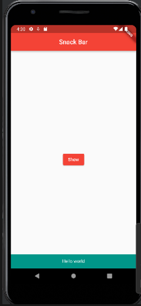

# toast message

```dart
import 'package:flutter/material.dart';

void main() => runApp(MyApp());

class MyApp extends StatelessWidget {
  @override
  Widget build(BuildContext context) {
    return MaterialApp(
      title: 'Snack Bar',
      theme: ThemeData(primarySwatch: Colors.red),
      home: NewPage(),
    );
  }
}

class NewPage extends StatelessWidget {
  @override
  Widget build(BuildContext context) {
    return Scaffold(
      appBar: AppBar(
        title: Text('Snack Bar'),
        centerTitle: true,
      ),
      body: MyBar(),
    );
  }
}

class MyBar extends StatelessWidget {
  @override
  Widget build(BuildContext context) {
    return Center(
      child: ElevatedButton(
        child: Text('Show'),
        onPressed: () {
          ScaffoldMessenger.of(context).showSnackBar(
            SnackBar(
              content: Text('Hello world',
              textAlign: TextAlign.center,
              style: TextStyle(
                color: Colors.white
              ),
              ),
              backgroundColor: Colors.teal,
              duration: Duration(milliseconds: 1000),
            ),
          );
        },
      ),
    );
  }
}
```

